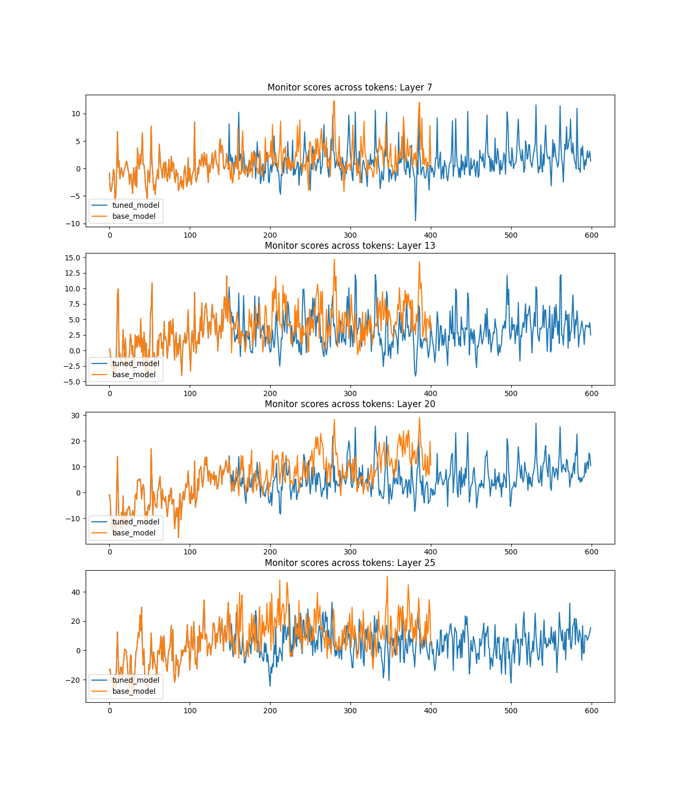

# Alignment Suppression and Safe Persona Amplification in LLMs  

## TL;DR  
Tuning with my proposed algorithm **amplified safe behaviour**: the tuned model showed **lower bias scores** than the base, with disparities **widening in later layers**. This suggests that alignment suppression acts more strongly at deeper layers.  
Note: A repo complementary to this one, where we test causality using activation patching - https://github.com/Yug-Oswal/cr-actpatch

---

## Overview  
I propose an algorithm that increases the probability **P(safe)** of a model behaving safely while reducing **P(unsafe)**.  

### Datasets  
We considered three subset distributions of the BBQ dataset:  
- **d1** – for collecting hidden states  
- **d2** – for algorithm-training the base model and obtaining tuned model (fewer than 3 samples)  
- **d3** – for evaluation  

### Models  
- **Base model**  
- **Tuned model** (trained with the proposed algorithm on *d2*)  

---

## Methodology  
1. **Hidden state collection**  
   - Ran the base model on *d1*  
   - Collected hidden states from layers **7, 13, 20, and 25**  
   - Extracted ~1200 tokens each from biased and unbiased outputs  

2. **Representation analysis**  
   - Computed a **contrastive vector**  
   - Trained a **discriminative linear probe**  

3. **Evaluation**  
   - Ran both base and tuned models on *d3*  
   - Obtained token-level **bias scores** by projecting hidden states onto the vector/probe  

---

## Key Observations  
1. **Bias scores decrease in later layers**  
   - Suggests alignment suppression intensifies deeper in the network.  

2. **Disparity grows between base and tuned models**  
   - Tuned model bias scores are consistently lower, with differences magnifying at deeper layers.  

### Hypotheses  
- Later-layer alignment suppression reinforces the already elevated **P(safe)**.  
- Tuned models favour safer reasoning paths, so bias is not induced.  
- Base models induce bias in their CoT, which is then **amplified as it propagates** through layers.  

---

## Results  
Plots (included in this repo) highlight notable token spans:  

- **Plot 1**: Around tokens 100, 250, 325, 550  
- **Plot 2**: Around tokens 200, 300, 350  

---

## Next Steps  
- Perform **activation patching** by transplanting tuned-model activations into the base model at points of bias score disparity spikes.  
- Test causal effects of alignment suppression vs. bias propagation.

---

## Plots:

